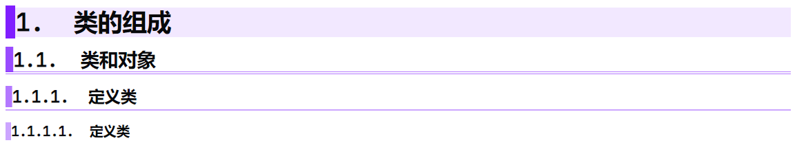
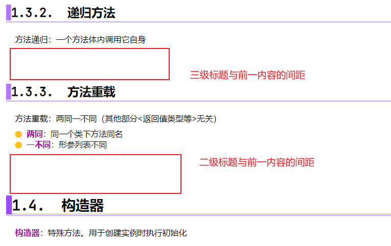
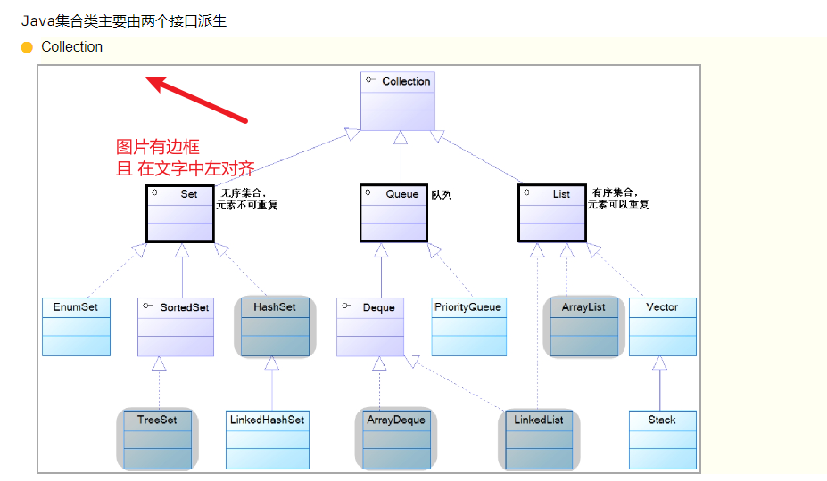
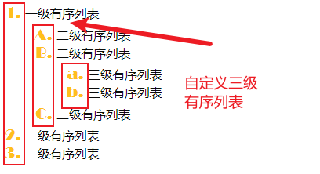
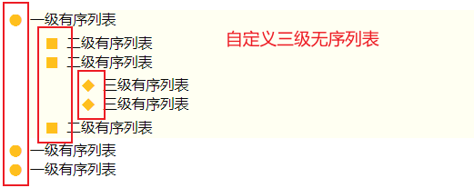
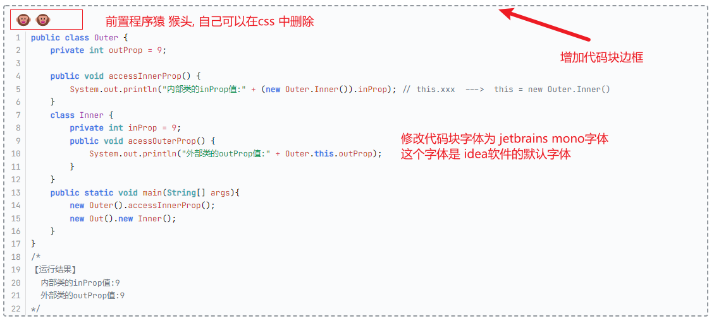
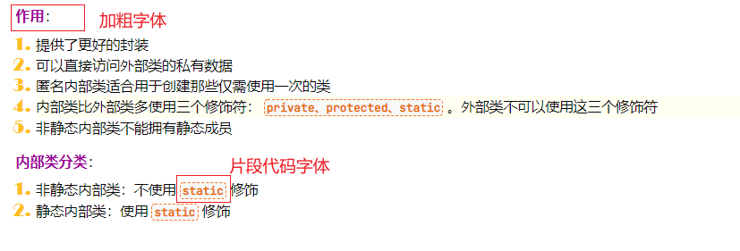
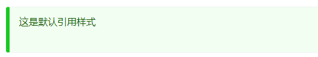
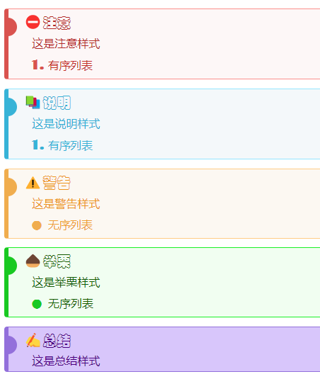
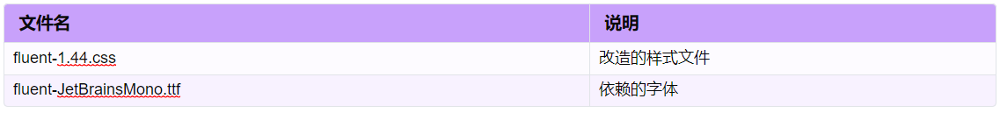

1. 基于官方主题 [Fluent](https://theme.typoraio.cn/theme/Fluent/) 的升级开发。同时参考了其他多个主题 [Lanyue](https://theme.typoraio.cn/theme/LanYue/)和[Haru](https://theme.typoraio.cn/theme/Haru/)升级。升级内容如下

2. 所有自定义样式，在css文件中都有注释说明，方便后面设置自己风格的样式

3. 引入方式：将下面两个文件引入到typora的主题文件夹，两个文件均在同一级文件夹

   | 文件名                   | 说明           |
   | ------------------------ | -------------- |
   | fluent-1.44.css          | 改造的样式文件 |
   | fluent-JetBrainsMono.ttf | 依赖的字体     |

# 1. 标题样式

【说明】

1. 自动给标题追加序号（这里我给标题设置了序号，因为githgub不能自定义CSS样式）。

2. 各级标题之间加入了样式进行区别标识。

   1. 一级标题：深紫色前缀 + 浅紫色底纹
   2. 二级标题：深紫色前缀 + 浅紫色双直线
   3. 三级标题：深紫色前缀 + 浅紫色单直线
   4. 四级标题：深紫色前缀

   

3. 有内容的情况下，各级标题的间距不同

   

# 2. 图片 样式

【说明】

1. 图片在文章中左对齐（原来是居中对齐）
2. 图片外加边框，突出显示

# 3. 有序列表和无序列表

## 3.1. 有序列表

## 3.2. 无序列表

# 4. 代码块样式

# 5. 加粗字体与片段代码

# 6. 引用格式

## 6.1 默认引用样式

## 6.2 自定义引用样式

需要修改 typora程序的源码，才能实现自定义引用样式。

可以查看我的博客，这个里面有教学方法[我的博客](https://blog.csdn.net/xi9972/article/details/116938475)

# 7. 表格样式

